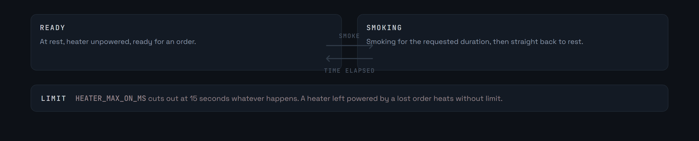
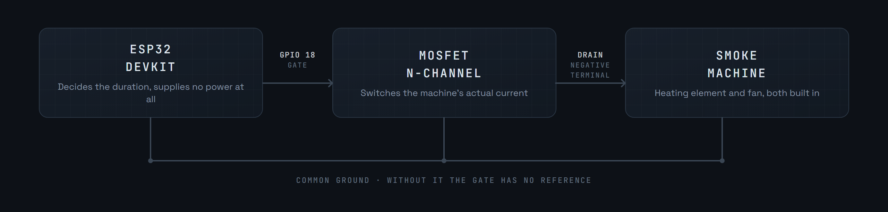

<div align="center">

<p>
  <a href="README.md"></a>
  
</p>


</div>

A smoke module for MicroCoaster layouts. An ESP32 switches a miniature smoke machine through a MOSFET, heater and fan both built in, for a set duration, then goes back to rest.

**Version 0.1.0-alpha**


The logic fits in two states. The module is ready, it is asked to smoke for N seconds, it smokes, it goes back to ready. Nothing else.



**No timing is handled locally.** If a minimum interval between two puffs is needed, it is for the controller to impose it. The module obeys.

That choice is deliberate: two components each deciding on their own when smoke may start again always end up contradicting each other. One authority, the controller.


`HEATER_MAX_ON_MS` bounds a cycle at 15 seconds. It is the only local protection, and it is essential: a heater left powered by a lost order or a dropped link heats without limit.

The MOSFET has to be sized for the machine's actual current, and its heat dissipation checked.




The smoke machine already has its heater and its fan, so the module drives a single line. In `include/config.h`: `PIN_HEATER` sets the control pin, `HEATER_MAX_ON_MS` the maximum duration of a cycle.


**Serial console**, at 115200 baud:

```
status          current state, time remaining, maximum duration
setdur 10       sets the duration of a cycle, in seconds
smoke           triggers a cycle if the state is READY
```

**WebSocket**, in JSON:

```json
{ "cmd": "STATUS" }
{ "cmd": "SET_DURATION", "s": 10 }
{ "cmd": "SMOKE" }
```

Replies:

```json
{ "ok": true, "state": "READY",   "duration_s": 10 }
{ "ok": true, "state": "SMOKING", "remaining_ms": 9800 }
```


Requires [PlatformIO](https://platformio.org/) inside Visual Studio Code.

```bash
pio run                  # build
pio run -t upload        # upload the firmware
pio device monitor       # serial console, 115200 baud
```


The specification, the wiring and the protocol are settled. The firmware is still to be written: today the repository holds only this documentation, the changelog and the licence.

The common base for every module is the [WiFi Manager](https://github.com/Microcoaster/MicroCoaster_WifiManager/blob/main/README.en.md), and the driving is done from the [WebApp](https://github.com/Microcoaster/MicroCoasterWebApp/blob/main/README.en.md).

---

<sub>MicroCoaster · Author: Cybertrist</sub>
