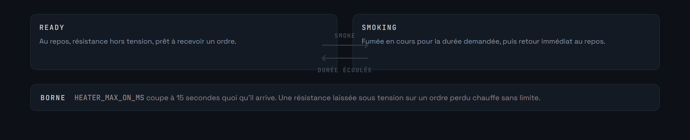
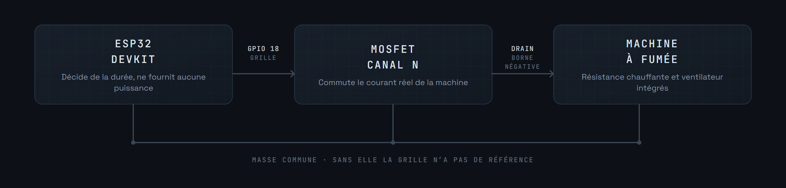

<div align="center">


</div>

Module de fumée pour circuits MicroCoaster. Un ESP32 commute par MOSFET une machine à fumée miniature, résistance chauffante et ventilateur intégrés, pendant une durée définie, puis revient au repos.

**Version 0.1.0-alpha**


La logique tient en deux états. Le module est prêt, on lui demande de fumer pendant N secondes, il fume, il revient prêt. Rien d'autre.



**Aucune temporisation n'est gérée localement.** Si une cadence minimale entre deux bouffées est nécessaire, c'est au contrôleur de l'imposer. Le module obéit.

Ce choix est délibéré : deux composants qui décident chacun de leur côté quand la fumée peut repartir finissent toujours par se contredire. Une seule autorité, le contrôleur.


`HEATER_MAX_ON_MS` borne la durée d'un cycle à 15 secondes. C'est la seule protection locale, et elle est indispensable : une résistance laissée sous tension sur un ordre perdu ou une liaison coupée chauffe sans limite.

Le MOSFET doit être dimensionné pour le courant réel de la machine, et sa dissipation thermique vérifiée.




La machine à fumée intègre déjà sa résistance et son ventilateur, le module ne pilote donc qu'une seule ligne. Dans `include/config.h` : `PIN_HEATER` fixe la broche de commande, `HEATER_MAX_ON_MS` la durée maximale d'un cycle.


**Console série**, à 115200 bauds :


```
status          état courant, temps restant, durée maximale
setdur 10       fixe la durée d'un cycle, en secondes
smoke           déclenche un cycle si l'état est READY
```

**WebSocket**, en JSON :


```json
{ "cmd": "STATUS" }
{ "cmd": "SET_DURATION", "s": 10 }
{ "cmd": "SMOKE" }
```

Réponses :


```json
{ "ok": true, "state": "READY",   "duration_s": 10 }
{ "ok": true, "state": "SMOKING", "remaining_ms": 9800 }
```


Nécessite [PlatformIO](https://platformio.org/) dans Visual Studio Code.


```bash
pio run                  # compilation
pio run -t upload        # téléversement du firmware
pio device monitor       # console série, 115200 bauds
```


La spécification, le câblage et le protocole sont posés. Le firmware reste à écrire : le dépôt ne contient aujourd'hui que cette documentation, le changelog et la licence.

Le socle commun à tous les modules est le [WiFi Manager](https://github.com/Microcoaster/MicroCoaster_WifiManager), et le pilotage se fait depuis la [WebApp](https://github.com/Microcoaster/MicroCoasterWebApp).

---

<sub>MicroCoaster · Auteur : Cybertrist</sub>
